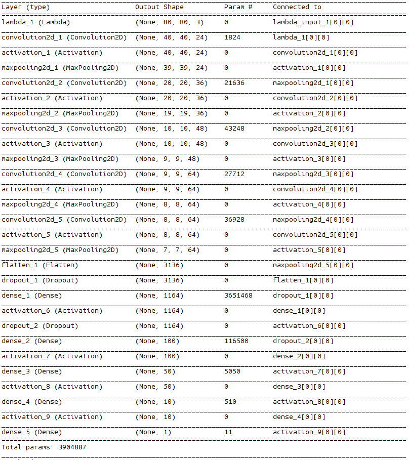

# Self-Driving Car Engineer Nanodegree Project: Behavioral Cloning with Deep Learning
by Xueyi Zou email:xy.zou@outlook.com

### Overview

The objective of this project is to make an autonomous agent to drive a car in a simulator provided by Udacity safely. This is achieved by cloning human driving behaviors with a Deep Neural Network, specifically, a Convolutional Neural Network (CNN).

The CNN was learnt during the training phase. First, a person navigates the simulated car inside the simulator using the keyboard or a game controller. While navigating the car the simulator records images perceived by the left, center, and right cameras installed in front of the car and the corresponding steering angles. Then, a CNN was trained to regress the steering angle for each image perceived by the center camera. The learning was achieved by minimizing the mean squared error (MSE) between the predictions (i.e. the predicted steering angles) and labels (i.e. the recoded steering angles).

In the test phase, the learnt CNN was used to drive the car in the same simulator. When testing, the simulator will pass the current center camera image to the driving agent, based on which the driving agent will return a steering angle (by using the learnt CNN) and a fixed throttle value.

### Dependencies

This project requires **Python 3.5** and the following Python libraries installed:

- [Keras](https://keras.io/)
- [NumPy](http://www.numpy.org/)
- [SciPy](https://www.scipy.org/)
- [TensorFlow](http://tensorflow.org)

note: Keras uses TensorFlow as backend, and its **"image_dim_ordering"** was set to **"tf"**.

### Files
- `preprocssor.py`: The script used to pre-process the dataset. After running it, four files named `img_names_train.npy`, `img_names_val.npy`, `steers_train.npy`, `steers_val.npy` will be generated.

- `model.py`: The script used to create and train the model.

- `model.json`: The model architecture.

- `model.h5`: The learnt model weights.

- `README.md`: (this file) explains the structure of the network and training approach.

### Train a Model
To train a model to drive the car autonomously, do the following:
1. put the `driving_log.csv` and the `IMG` folder containing the training images inside the `data` folder
1. run `preprocessor.py`
1. run `model.py`

The learnt model structure was saved in `model.json` and its weights were saved in `model.h5`.

### Run the Model
To run the model, do the following steps:
1. `python drive.py model.json`
2. open the Udacity simulator and select the autonomous mode.

The car will then be driven autonomously.

## How Was the Model Learnt

### Dataset and Dataset Augmentation

I first used a dataset collected by myself using keyboard to control the simulated car. However, since the keyboard's control has a lot of spikes, the learnt model was not satisfactory. I then turn to the dataset provided by Udacity. The Udacity dataset consists of 8036 center camera images. Due to nature of the track, the majority of the recorded steering angles are zeros. To avoid always predicting zeros by the model, and to train the model to recover the car when it is off the center, two ways were used to **augment** the dataset:

- Using the left and right camera images (8036 for each camera): the steering angles of the left camera were set to the corresponding center camera images steering angle **plus** an offset of _0.25_, and the steering angles for the right camera were set to the corresponding center camera images steering angle **minus** an offset of _0.25_.

- Flipping right and left the images whose corresponding steering angles are not "0+/-0.01", "-0.25+/-0.01", or "0.25+/-0.01". The new steering angles for the flipped images were the opposite of the original.

After the above treatment, the augmentd dataset consists **34860** images, and its steering angles' distribution is as following:
<p align="center">
 
</p>

From the distribution, we can notice that the data were distributed quite unevenly, which may pose difficulties to the learning algorithm. This was handled by assigning smaller importance weights to those items with steering angles equal to "-0.25", "0", or "0.25" (see later).

### Data Preprocessing
In addition to the aformentioned flipping step, all the images were cropped and resized, which were conducted by the following code:

```
h,w = 80,80
image = imresize(image[60:140,:,:],(h,w))
```
I cropped the images to keep only the important information for driving, and I resized the images to reduce computation effort.

Note that all the images were processed before being used for training.

Some of the clipped and resized but non-flipped images are shown as follows:

Left| Center| Right         
----|--------|-------
 |  | 

Some of the clipped and resized and flipped images are shown as follows:

Left| Center| Right
----|--------|-------
 |  | 

### Training and Validation Split

The augmented dataset were split as training dataset and validation dataset by the following code:
```
img_names_train, img_names_val, steers_train, steers_val
= train_test_split(img_names, steers, test_size=0.2, random_state=0)
```
### Network Architecture

The network architecture was based on NVIDIA's paper titled "[End to End Learning for Self-Driving Cars](https://images.nvidia.com/content/tegra/automotive/images/2016/solutions/pdf/end-to-end-dl-using-px.pdf)".

Following is a summary of my modified model:
<p align="center">
 
</p>

The main differences between my model and the NVIDIA's mode are:
- I used additional **MaxPooling** layers after each  Convolutional Layer to reduce training time.
- I used a **Dropout** layer after the Flatten layer to overcome overfit.

### Training
I used NVIDIA GEFORCE 940M  GPU to train the model.

The dataset is too large to load into the memory, so I used `fit_generator` of the Keras library for training the model. `fit_generator` uses python generators to generate batch data.

In the `model.py`, I created two generators:
- `gen_train(img_names_train,steers_train, batch_size)`
- `gen_val(img_names_val,steers_val, batch_size)`

The code for `gen_train()` is as follows:

```
def gen_train(img_names_train,steers_train, batch_size):
    def f():
        start = 0
        end = start + batch_size
        n = len(img_names_train)
        while True:
            X_batch = _read_imgs(img_names_train[start:end])
            y_batch = steers_train[start:end]
            sample_weights = np.ones_like(y_batch)
            sample_weights[y_batch==0] = 0.5
            sample_weights[y_batch==steer_offset] = 0.5
            sample_weights[y_batch==-steer_offset] = 0.5

            start += batch_size
            end += batch_size
            if start >= n:
                start = 0
                end = batch_size
            yield (X_batch, y_batch, sample_weights)
    return f```


Note the **sample_weights** where I assigned a weight of 0.5 to those dominant items whose steering angles are "-0.25", "0", or "0.25". In this way, their influence to the cost function will be reduced.

The batch size of both `gen_train` and `gen_val` was 128.

I used `Adam` optimizer with a learning rate of `1e-4`.

I tried to set the number of epochs to be `5`, `8`, `10`,`15`, `20`, and finally I found `15` works well.


## Results
The model can drive the car safely in the first track, but it has some problem in the second track. I may have to use some images from the second track as training data to train the model, which I will try later.
